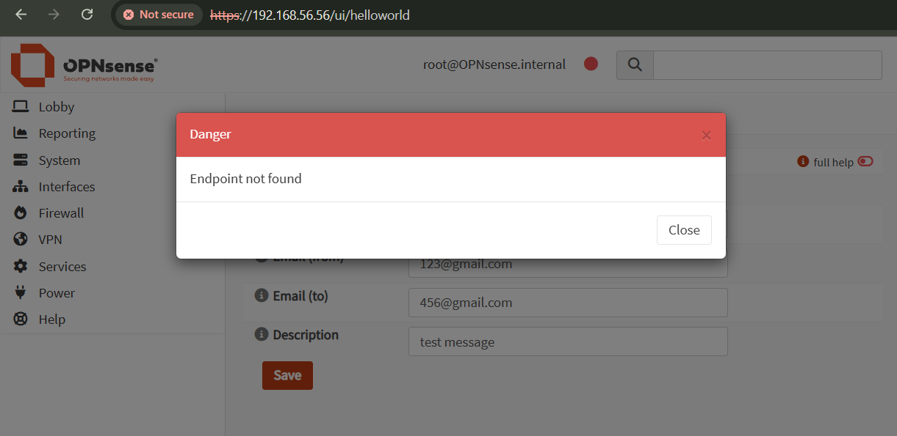
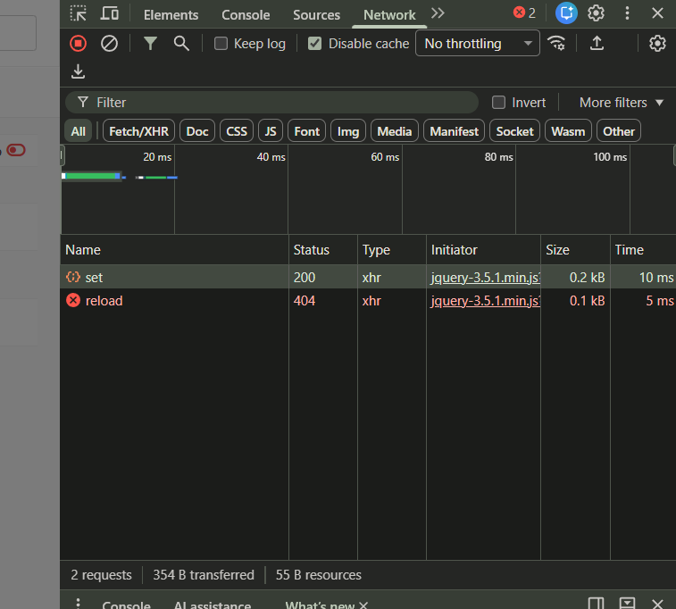
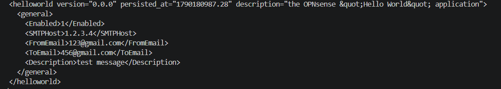
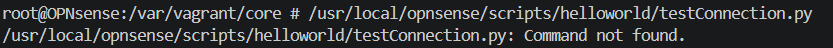
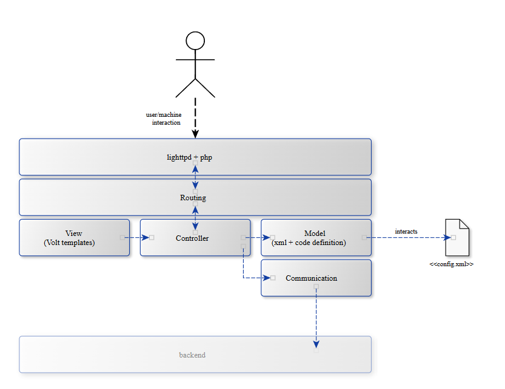

# Báo cáo tuần 1
> Thời gian: 19/09/2026 đến 26/06/2026  

## 1. Nhiệm vụ:
Hoàn thành mục Examples trong doc của OPNsense

## 2. Khó khăn gặp phải + giải pháp
### 2.1 "Endpoint not found" khi test chức năng save form (Hello World Example)
Khi test nút `Save` thì bị lỗi như hình:

Kiểm tra tab Network trong DevTools thì thấy lỗi ở `reload`:
  
Kiểm tra lại mã nguồn:
```
$("#saveAct").click(function(){
    saveFormToEndpoint("/api/helloworld/settings/set",'frm_GeneralSettings',function(){
        // action to run after successful save, for example reconfigure service.
        ajaxCall(url="/api/helloworld/service/reload", sendData={},callback=function(data,status) {
            // action to run after reload
        });
    });
});
```
Ở đây hàm saveFormToEndpoint gọi đến 2 endpoint là `set` và `reload`. File `SettingsController.php` và `ServiceController.php` đều có các class controller kế thừa từ `ApiMutableModelControllerBase`.     
Kiểm tra lại mã nguồn `ApiMutableModelControllerBase.php` thì thấy chỉ có sẵn phương thức `setAction()`, chưa có `reloadAction()` => Phải tự viết thêm phương thức này.  

---> Fix:
- Thêm method `reloadAction()` vào endpoint service:
```
public function reloadAction()
{
    $status = "failed";
    if ($this->request->isPost()) {
        $status = strtolower(trim((new Backend())->configdRun('template reload OPNsense/HelloWorld')));
    }
    return ["status" => $status];
}
```
- Tạm thời sửa lại thành `extends ApiControllerBase` để tránh bị lỗi `500` do thiếu khai báo `$internalModelClass` và `$internalModelName` theo quy định của class `ApiMutableModelControllerBase`
- Test lại và thấy file `config.xml` đã cập nhật dữ liệu mới:


### 2.2 'Command not found' khi chạy file `testConnection.py` (Hello World Example)
File `testConnection.py` có nội dung như sau:
```
#!/usr/local/bin/python3
print("Hello World!")
```
Chạy thử file với lệnh ```/usr/local/opnsense/scripts/helloworld/testConnection.py``` thì bị lỗi `command not found`:


---> FIX:
- Lý do lỗi: Trên Windows, khi ấn `Enter`, trình biên soạn tự chèn thêm 2 kí tự ẩn `\r` và `\n`. Khi đưa file này lên FreeBSD, FreeBSD không hiểu kí tự `\r` như Windows và coi là một phần của đường dẫn `/usr/local/bin/python3` -> Hệ thống tìm 1 file tên là `python3\r` -> Không tìm được -> `Command not found`
- Cách fix: 
    - Đổi định dạng lưu file từ `CRLF` sang `LF` 
    - Chạy lại lệnh:
```
make install
```  
Có thể kiểm tra lại bằng lệnh:
```
cat -v /usr/local/opnsense/scripts/helloworld/testConnection.py | head -n 1
```
<i>Nếu màn hình in ra #!/usr/local/bin/python3 và không có kí tự ^M ở cuối dòng là thành công</i>

## 3. Note lại một số kiến thức
### Kiến trúc MVC (Model, View, Controller):
Là một kiến trúc quản lí mã nguồn. Mã nguồn được viết theo kiến trúc này sẽ chia làm 3 phần:
- View: giao diện tương tác với người dùng
- Model: xử lí dữ liệu
- Controller: xử lí các request từ người dùng, chuyển request đến phần Model để xử lí, sau đó trả lại kết quả từ Model cho View

MVC trong OPNsense:  

```
Workflow:
User gửi request -> lighttpd tiếp nhận request -> Routing lựa chọn Controller tương ứng -> Controller xử lí (thực hiện các action theo request, trả về giao diện html,...)
```

